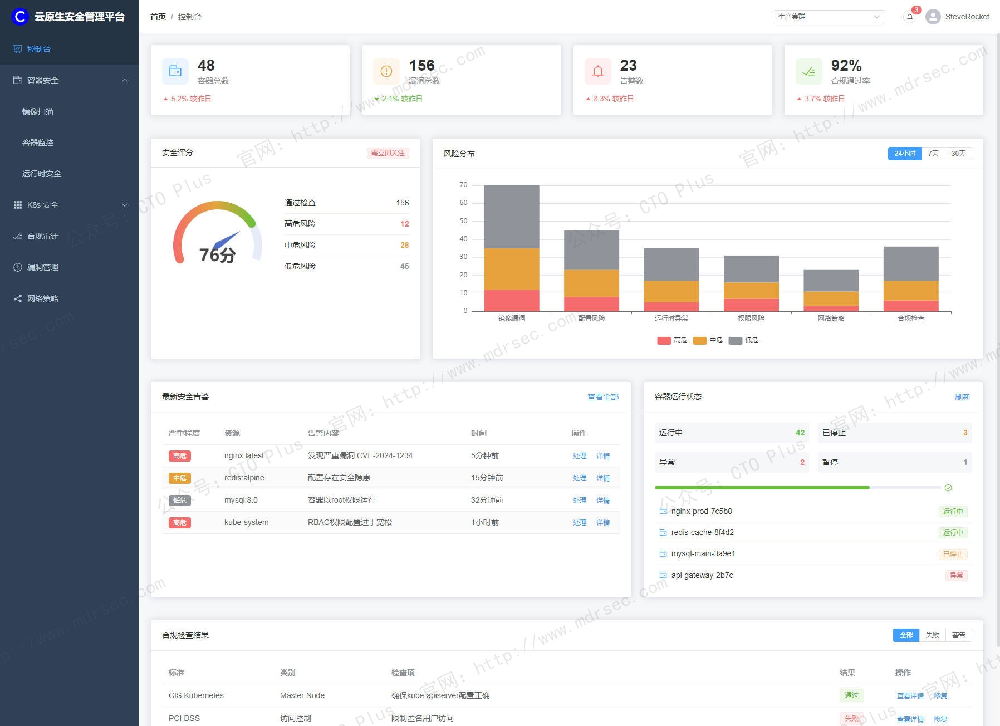
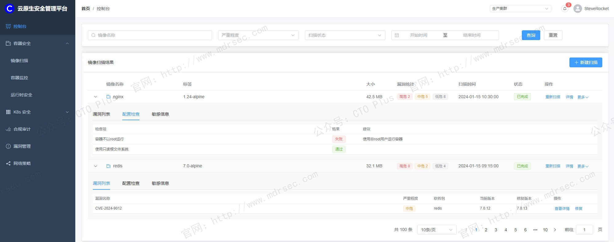
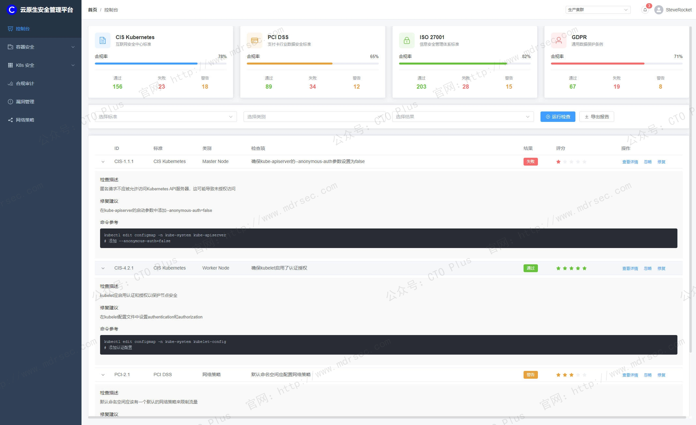
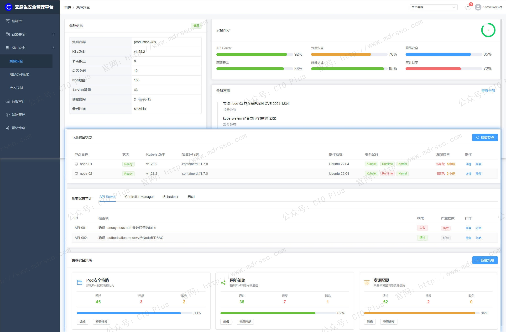

# 云原生安全管理平台（CNAPP）

## 关于我们

- 官网： http://www.mdrsec.com

我们的技术文章和产品概述欢迎浏览我们的门户。

- 公众号：CTO Plus

最新的动态欢迎关注我们官方唯一公众号。

- 作者QQ

更详细更具体的需求，或者项目合作，或者问题 欢迎联系我。

- QQ群

我们官方组建的QQ群，如果您有兴趣也可以加入我们。

- 请喝咖啡

如果感兴趣，也可以请我喝杯咖啡

## 产品核心功能模块

过去十年，企业上云的逻辑发生了根本性转变。从最初的虚拟机迁移到如今的容器化、微服务化、Serverless化，云原生技术带来的不仅是弹性和敏捷，更是一套全新的安全命题。传统的边界防火墙、主机安全Agent、季度漏洞扫描——这些以“不变应万变”的安全手段，在动态编排的Kubernetes集群和按秒启停的Serverless函数面前，显得格格不入。

云原生环境的特征可以概括为三个关键词：**短生命周期**（容器平均存活仅数小时）、**动态调度**（IP地址和运行节点持续变化）、**基础设施即代码**（配置变更通过CI/CD流水线高频推送）。这些特征导致三大安全困局：其一，**资产可见性黑洞**——安全团队说不清此刻有多少Pod在运行、多少S3桶对公网开放；其二，**配置漂移常态化**——开发人员为调试临时开放权限后忘记回收，生产环境与基线渐行渐远；其三，**告警风暴与工具孤岛**——CSPM报配置风险、CWPP报进程异常、CIEM报权限过度，不同工具各说各话，运维人员疲于奔命 。

正是为了解决这些碎片化困局，Gartner在2021年正式提出CNAPP（Cloud-Native Application Protection Platform，云原生应用保护平台）的概念。CNAPP不是单一工具的简单集成，而是一种**平台化、全生命周期、风险上下文关联**的安全理念——它将开发阶段的制品扫描、部署阶段的配置检查、运行时的威胁检测统一到同一数据模型和交互界面中，让安全从“事后救火”转向“事前预防+事中阻断+事后溯源”的完整闭环 。

本文我将从架构基础、核心功能模块、智能化演进三个维度，系统的为大家介绍下我们自研的 云原生应用保护平台（CNAPP），以下简称CNAPP

---

## 一、CNAPP的架构基础：三大支柱与双向反馈

### 1.1 三大核心能力域

根据中国信通院《云原生应用保护平台（CNAPP）能力要求》标准，CNAPP的能力体系可划分为**制品安全、基础设施安全、运行时安全**三大域，涵盖15个功能模块、500余项能力指标 。从产业实践来看，这三大域对应着云原生应用生命周期的三个关键阶段：

- **开发阶段（制品安全）** ：代码编写、镜像构建、依赖库引入时的安全检测，核心是“安全左移”——在问题进入生产环境前消灭它。
- **部署阶段（基础设施安全）** ：云平台配置检查、身份权限治理、IaC模板扫描，核心是“防患于未然”——确保基础设施的每一块砖都砌在正确的位置。
- **运行阶段（运行时安全）** ：工作负载行为监控、容器逃逸检测、API异常流量识别，核心是“实时感知与响应”——当预防失效时，能在最短时间内止损。

三大域并非彼此孤立。例如，制品阶段扫描出的高风险漏洞，应自动关联到运行时该容器的实际运行状态（是否以root运行、是否暴露公网端口），从而计算出“漏洞可被利用的概率”，指导运维团队精准排定修复优先级。这种跨域关联分析正是CNAPP区别于“多工具堆叠”的核心价值 。

### 1.2 CSPM、CWPP、CIEM、CDR的有机整合

从技术组件视角看，我们自研的 云原生应用保护平台（CNAPP）整合了云安全领域四类核心工具的能力：

| 组件                  | 核心职责                       | 典型检测场景                     |
|---------------------|----------------------------|----------------------------|
| **CSPM**（云安全态势管理）   | 持续监控云资源配置是否符合安全基线          | S3桶公开访问、安全组规则过宽、加密未开启      |
| **CWPP**（云工作负载保护平台） | 保护云主机、容器、Serverless函数运行时安全 | 容器逃逸、恶意进程启动、Webshell写入     |
| **CIEM**（云基础设施授权管理） | 分析和管理云账号、角色、权限的风险          | 过度授权的IAM角色、长期未轮换的AccessKey |
| **CDR**（云检测与响应）     | 汇聚多源遥测数据，检测攻击链条并自动化响应      | 异常API调用序列、横向移动行为、数据外泄      |

我们的CNAPP平台需要将这些能力**统一数据模型、统一策略引擎、统一分析界面**，而非简单拼接。例如，Fortinet的Lacework FortiCNAPP通过“复合告警”机制，将CWP的进程行为数据与CDR的云审计日志关联分析，当检测到某容器同时出现“异常进程启动”与“调用高危API”时，生成一条高置信度告警，而非两条孤立告警 。

### 1.3 “双向反馈”闭环机制

我们的CNAPP区别于传统扫描工具的另一个关键特征是**双向反馈**——安全发现不仅能告警，还能自动化地反馈到开发和运维流程中：

- **向前反馈**：运行时发现的攻击行为，其攻击路径中的弱点（如被利用的漏洞、被滥用的权限）自动生成修复工单，反馈给开发团队在下一次迭代中修复。
- **向后反馈**：开发阶段扫描出的高危漏洞，在代码合入前即阻断CI/CD流水线，防止问题流入生产环境。

这种闭环能力让安全从“旁观者”变为“参与者”，真正融入DevOps的敏捷节奏 。

---

## 二、制品安全：将防线前移至开发侧

制品安全是我们的CNAPP能力体系的起点，其核心理念是**安全左移（Shift Left）** ——在代码编写和镜像构建阶段即发现并修复安全问题，大幅降低生产环境的修复成本。

### 2.1 镜像与依赖组件扫描

容器镜像的安全风险主要来自三个层面：基础镜像的系统漏洞、应用依赖的开源组件漏洞、以及打包时引入的恶意文件。CNAPP的镜像扫描能力应覆盖：

- **系统漏洞扫描**：识别镜像操作系统层（如Alpine、Ubuntu、CentOS）的已知CVE漏洞，并给出修复建议（如升级到哪个版本、更换哪个基础镜像）。
- **软件成分分析（SCA）** ：解析应用依赖的第三方库（如npm、pip、Maven包），识别存在已知漏洞的组件版本。一个典型场景是Log4j2漏洞爆发时，SCA能快速定位哪些镜像引入了受影响版本的log4j-core。
- **恶意文件检测**：检测镜像中是否包含挖矿程序、后门脚本、硬编码的私钥等恶意或敏感内容。

镜像扫描还支持**漏洞可达性分析**——并非所有CVE都值得同等重视。若漏洞所在函数在运行时从未被调用，或容器网络策略使其无法对外通信，该漏洞被利用的概率极低。我们的CNAPP平台将漏洞库信息与运行时上下文关联，帮助运维人员聚焦真正危险的漏洞 。

### 2.2 IaC安全与配置代码化检测

云原生环境中，基础设施由代码定义——Terraform声明资源、Kubernetes YAML描述部署、Dockerfile定义构建。IaC的配置错误会以代码形式被批量复制，其影响远大于手工操作的误配置。

我们的CNAPP支持对以下IaC文件的静态扫描：

- **Kubernetes清单文件**：检测是否以root用户运行容器、是否挂载了宿主机敏感目录、是否设置了资源限制（防止DoS）、是否声明了readonlyRootFilesystem。
- **Terraform模板**：检测是否创建了公开的S3桶、安全组是否开放了0.0.0.0/0的22端口、RDS实例是否开启了加密。
- **Dockerfile**：检测是否使用了latest标签（导致不可重复构建）、是否以root执行RUN命令、是否在镜像中残留构建密钥。

这些检查集成到CI/CD流水线中，在Pull Request阶段即自动执行，不合规的代码无法合并到主干分支 。

### 2.3 敏感信息与密钥泄露防护

开发人员常将数据库密码、API Key、TLS私钥等敏感信息硬编码在代码或配置文件中，一旦代码仓库被攻破或公开，后果不堪设想。我们的CNAPP的敏感信息检测能力包括：

- **静态扫描**：在代码仓库、镜像层、环境变量中通过正则匹配和熵值分析识别疑似密钥的字符串。
- **动态阻断**：当检测到开发者试图git push包含密钥的代码时，实时阻断并告警。
- **密钥溯源与吊销**：对于已泄露的密钥，能够追踪其在哪些资源中被使用，并联动密钥管理系统自动轮换。

我们CNAPP的Secret Scan功能可集成到GitHub Action中，每次push时自动扫描，一旦发现AWS AccessKey或数据库连接串等敏感信息，立即在平台触发告警并提供修复建议 。

---

## 三、基础设施安全：消除配置层的“看不见的风险”

制品安全解决的是“将要部署的东西是否安全”，而基础设施安全解决的是“部署环境本身是否牢固”。云平台配置错误是数据泄露的首要元凶——Verizon《2024数据泄露调查报告》显示，配置错误导致的泄露占比超过20%。

### 3.1 云安全态势管理（CSPM）

CSPM是我们CNAPP中最为成熟的模块，其核心职能是**持续评估云资源配置是否符合安全基线和合规标准**。我们的CSPM具备以下检测能力：

- **存储安全**：检测对象存储桶（S3、OSS、GCS）是否对公网开放、是否启用版本控制和加密、日志是否开启。
- **网络安全**：检测安全组/防火墙规则是否存在any（0.0.0.0/0）放行高危端口（22/3389/3306）、VPC流日志是否启用。
- **密钥与凭证安全**：检测云账号AccessKey是否超过90天未轮换、是否存在从未使用但权限过高的闲置账号。
- **日志与审计**：检测云审计日志（CloudTrail、ActionTrail）是否开启全局覆盖、日志存储桶是否不可变。
- **加密状态**：检测云硬盘、数据库实例、对象存储是否开启静态加密，证书是否即将过期。

我们CSPM的另一关键能力是**合规性自动化**——将ISO 27001、PCI-DSS、等级保护、CIS Benchmark等合规框架转化为可自动执行的检测规则。我们的CSPM支持31项合规标准的自动化检查，当检测到配置偏离时，不仅告警风险等级，还提供具体的修正步骤（如“建议将security group规则中0.0.0.0/0修改为特定IP段”）。同时，CSPM模块同样提供等保、CIS等基线的一键检测 。

### 3.2 云基础设施授权管理（CIEM）

如果说CSPM关注的是“东西怎么摆”，我们的CIEM关注的则是“谁能动什么东西”。云原生环境的权限管理复杂度远超传统数据中心——有些IAM系统有超过5000种权限颗粒度，一个中型企业可能管理着数万个角色和策略，过度授权几乎是必然结果。

我们CIEM的核心能力包括：

- **权限可视化**：以图形化方式呈现用户/角色/资源/权限之间的映射关系，快速定位“谁有权删除S3桶”“谁可以修改IAM策略”。
- **过度授权检测**：基于历史API调用记录分析，识别“拥有高权限但从未使用”的僵尸权限。例如，某角色被授予了s3:DeleteBucket权限，但过去90天内从未调用，则应建议回收。
- **权限爆破路径分析**：模拟攻击者视角，分析从低权限账号出发，通过权限链组合能获取的最高权限（如先读取某Lambda的环境变量获得AK，再通过该AK的s3:GetObject权限读取敏感数据）。
- **最小权限建议**：根据实际使用的权限列表，自动生成精细化的IAM策略，将通配符“*”替换为具体资源ARN和操作动词。

我们的CIEM模块实现了“实时检测集群用户权限、角色配置风险，可视化呈现权限漏洞” 。CIEM还能自动生成权限修正策略，并与ITSM系统联动发起审批流程。

### 3.3 Kubernetes安全态势管理（KSPM）

Kubernetes作为云原生的操作系统，其自身配置的安全性直接影响所有上层应用。KSPM可以理解为CSPM在K8s领域的垂直深化，重点检测以下配置项：

- **API Server安全**：是否禁用匿名访问、是否启用RBAC鉴权、审计日志是否配置。
- **工作负载安全**：Pod是否以特权模式运行、是否配置了securityContext（如runAsNonRoot、readOnlyRootFilesystem）、是否声明了资源limit/request。
- **网络策略**：是否部署了NetworkPolicy限制Pod间东西向通信，是否存在“允许所有Pod互访”的默认策略。
- **Secret管理**：Secret是否以明文存储在etcd中（未加密）、是否挂载到不需要的Pod中。

我们的系统也符合中国信通院发布的《云原生安全配置基线规范V2.0》对Kubernetes安全配置、容器运行时安全配置、镜像安全配置、工作负载安全配置四大类中的17个能力子项的评估标准。

---

## 四、运行时安全：从静态扫描到动态感知

静态检查能发现配置层面的问题，但无法应对运行时的真实攻击——零日漏洞、0-click RCE链、供应链后门，这些威胁只有在运行时才会暴露。我们CNAPP的运行时安全能力覆盖工作负载行为、容器边界、API通信、数据流动四个维度。

### 4.1 云工作负载保护（CWPP）

CWPP负责保护运行中的云主机、容器、Serverless函数。与传统主机安全不同，我们的云原生工作负载的CWPP具备**无代理或轻量代理、行为基线学习、攻击链关联**的特点。

- **行为建模与异常检测**：CWPP通过eBPF或内核模块采集进程创建、文件访问、网络连接、系统调用等行为数据，建立每个工作负载的正常行为基线（如nginx容器只执行nginx进程、只监听80端口、只读取静态文件）。当出现偏离基线的行为时告警——如Web容器内突然执行curl下载脚本、数据库容器发起外网连接。
- **内存与进程保护**：检测内存马注入、进程注入、无文件攻击等高级对抗手段。应用防护（RASP）技术可在应用运行时插桩，实时检测SQL注入、命令执行、反序列化等攻击，并在攻击生效前阻断 。
- **容器逃逸检测**：检测容器内挂载宿主机敏感目录（/proc、/sys、/var/run/docker.sock）、创建特权容器、利用内核漏洞突破namespace隔离等逃逸行为。
- **勒索与挖矿防护**：检测勒索病毒的文件加密行为（大量文件的熵值突变）和挖矿程序的算力特征（持续高CPU使用率+特定矿池域名解析）。

我们的CWPP模块在Linux LSMs和eBPF技术栈上构建了“实时阻断”能力——不仅检测攻击，更能在攻击发生的瞬间通过内核级策略阻止恶意行为，如禁止容器内执行包管理命令（apt install/yum install），从根源上阻断攻击者在容器内部署工具链的可能 。

### 4.2 容器网络微分段与横向移动防御

默认情况下，Kubernetes集群内所有Pod可以自由互访。一旦攻击者控制了某一Pod，就可以以此为跳板横向移动至数据库Pod、缓存Pod乃至API Server。网络微分段的目标是**将“零信任”原则贯彻到容器网络层**。

我们CNAPP的微分段能力特点如下：

- **网络流量的可视化拓扑**：自动生成Pod级别的网络依赖关系图，展示谁在调用谁、端口是什么、协议是什么、流量量级如何。
- **自动化策略生成**：基于观测到的正常流量，一键生成“仅允许必要通信”的NetworkPolicy，阻断所有未观测到的异常连接。
- **策略模拟与影响分析**：在策略下发前模拟其影响范围，避免因策略过严导致业务中断。
- **L7层精细化控制**：不仅控制IP和端口，还能控制HTTP方法、API路径——例如只允许特定服务调用/api/orders的POST方法，禁止DELETE方法 。

### 4.3 API与Web应用安全（WAAP整合）

现代云原生应用本质上是API的集合——微服务间通过gRPC/HTTP API通信，前端通过RESTful/GraphQL调用后端。API已经成为攻击者的首要目标。CSA指出，传统CNAPP最大的盲区在于“只看到基础设施，看不到应用层”——它能检测S3桶是否公开，却不知道某API正在以可遍历的ID参数泄露全部用户数据 。

因此，我们的CNAPP平台也慢慢在集成WAAP（Web应用与API保护）的能力：

- **API资产发现与分类**：自动扫描云环境中的API端点（包括内部服务API、对外Gateway API、Serverless函数触发器），识别“影子API”（未经过网关管控的直连API）和“僵尸API”（已废弃但未下线的API）。
- **OWASP API Top 10检测**：检测API对象级别授权漏洞（BOLA）、过度数据暴露、批量分配、注入攻击等典型API风险。关键在于结合运行时的实际流量分析，而非仅依赖OpenAPI规范文档的静态检查——文档可能已过时，但流量不会说谎。
- **敏感数据流动追踪**：监控API请求和响应中的PII、密钥、Token等敏感数据，检测是否存在明文传输敏感数据、响应体包含过多字段（如返回用户对象时连带返回密码哈希）等问题。这对满足GDPR、个人信息保护法的数据最小化要求尤为重要 。
- **Bot管理与DDoS缓解**：识别和拦截恶意爬虫、撞库攻击、API滥用等自动化威胁。

### 4.4 云检测与响应（CDR）

CDR是CNAPP的“中枢神经系统”，负责将CSPM的配置事件、CWPP的行为告警、CIEM的权限变更、WAAP的API异常等多源遥测数据汇聚到统一的数据湖中，通过关联引擎发现孤立告警无法揭示的攻击链条。

我们的CDR具备：

- **多源遥测汇聚**：云审计日志（管理面操作）、VPC流日志（网络流量元数据）、工作负载系统日志（数据面行为）、API网关日志（应用层请求）统一接入。
- **攻击链关联**：将看似孤立的告警串联为完整的杀伤链。例如：某IP扫描了Web端口（侦察）→ 数分钟后尝试SQL注入（武器化）→ 随后容器内出现异常进程启动（利用成功）→ 该进程发起对数据库服务的内网连接（横向移动）。单看每一步都是低风险，串联后则揭示出一次正在进行中的入侵。
- **自动化调查与溯源**：基于告警自动生成事件时间线，还原攻击者进入系统的初始入口、执行的操作序列、影响的资源范围，将数小时的调查工作压缩到分钟级。
- **响应编排**：联动安全编排自动化与响应（SOAR）能力，在检测到确凿攻击时自动执行处置动作——隔离Pod、冻结IAM账号、阻断特定IP、创建快照用于取证——将平均响应时间从小时级压缩至分钟级 。

我们CNAPP的Composite Alerts机制即是CDR理念的体现：将CWPP Agent采集的容器内进程行为、文件变更信号，与云审计日志中的API调用记录进行时序和实体关联，生成高保真复合告警，显著降低误报率 。

---

## 五、统一平台能力：从工具集合到智能中枢

### 5.1 统一资产清单与风险图谱

我们CNAPP的首要平台能力是构建**多云环境下的统一资产模型**。它能自动发现并持续同步以下资产信息：

- 云厂商IaaS/PaaS资源（计算、存储、网络、数据库、Serverless）
- Kubernetes原生资源（Cluster、Node、Namespace、Pod、Service、Ingress、Secret）
- 镜像仓库资产（镜像版本、分层依赖、漏洞扫描结果）
- 身份资产（IAM用户、角色、策略、服务账号、API Key）

更重要的是，资产之间应建立**关系图谱**——该Pod运行在哪个Node上、挂载了哪个PVC、被哪个Service暴露、该ServiceAccount绑定了哪个IAM角色——如此才能在告警时提供完整上下文：“不仅告诉你哪台机器出事了，还告诉你这台机器承载了什么业务、谁负责、暴露面有多大” 。

### 5.2 风险关联与攻击路径分析

孤立的风险信息价值有限。一个“高风险漏洞”在无法对外通信且非root运行的容器中，其实际危害远小于一个“中风险配置错误”的公开数据库端口。我们CNAPP的核心价值在于**将漏洞、配置错误、权限过度、网络暴露面四类风险信息进行关联计算**，输出“可被利用的风险”——即攻击者视角的攻击路径。

CSA将这种关联分析称为“Toxic Combination”（毒性组合）分析——识别若干本身危害不大、组合后却致命的弱点。例如：

- 某容器存在RCE漏洞（CVSS 9.8）+ 该容器挂载了宿主机的docker.sock（配置不当）+ 容器以root运行（权限过度）= 攻击者可利用RCE漏洞获取容器root shell，进而通过docker.sock逃逸至宿主机并控制整个集群 。

我们的CNAPP平台能自动计算此类攻击路径，并以可视化的方式呈现（攻击图），指导安全团队精准排险——与其修复100个理论上的高危漏洞，不如堵死这3条真实的攻击路径。

### 5.3 AI驱动的智能化增强

AI（特别是大语言模型）的引入正在从两个维度增强我们的CNAPP系统：

- **告警降噪与根因分析**：LLM能将碎片化的告警描述（“检测到异常进程”“网络连接矿池域名”“CPU持续100%”）生成为自然语言的事件摘要：“该Pod疑似被植入挖矿木马，攻击者可能通过镜像供应链投毒方式进入，建议立即隔离Pod并检查镜像来源”。这降低了安全运营的门槛，让初级分析师也能理解复杂攻击。
- **自然语言交互查询**：安全分析师不再需要记忆复杂的KQL/Splunk查询语法，可直接用自然语言提问——“列出所有暴露在公网且包含Log4j的容器”“显示上周创建的所有未加密S3桶”，AI负责将自然语言转换为查询语句并返回结果。

我们在CNAPP方案中融合AI实现威胁预测与智能响应 。

### 5.4 多云与混合云统一管理

企业多云战略已成常态——AWS承载数据分析、Azure负责办公协同、天翼云/阿里云运行核心业务系统。我们的CNAPP支持**跨云统一策略管理**：

- **统一的合规基准**：一套CIS策略可同时检测AWS、Azure、GCP、阿里云环境，无需为不同云平台编写不同规则。
- **统一的风险评分**：跨云资产使用同一套风险计算模型，确保“阿里云上的高危漏洞”与“AWS上的高危漏洞”表达的风险等级一致。
- **统一的响应动作**：检测到同一类攻击时，无论发生在哪个云平台，均可触发标准化的响应Playbook。

此外，针对金融、政务等有数据驻留要求的行业，我们的CNAPP还支持**本地化部署**——管理平台和检测引擎均可在用户自有数据中心离线运行，仅向外拉取漏洞库更新 。

---

## 六、最后

### 6.1 CNAPP核心能力

综合以上分析，我们的企业级CNAPP平台具备以下能力矩阵：

| 能力域        | 核心功能                       | 关键价值指标                    |
|------------|----------------------------|---------------------------|
| **制品安全**   | 镜像扫描、SCA、IaC扫描、敏感信息检测      | 问题代码合入阻断率、平均修复时间（MTTR）    |
| **基础设施安全** | CSPM、CIEM、KSPM             | 配置合规覆盖率、权限利用率、基线偏离发现时间    |
| **运行时安全**  | CWPP（行为检测/逃逸检测）、网络微分段、WAAP | 攻击检测覆盖率、告警误报率、横向移动阻断成功率   |
| **检测与响应**  | 遥测汇聚、攻击链关联、自动化溯源           | 平均检测时间（MTTD）、平均响应时间（MTTR） |
| **平台能力**   | 统一资产清单、风险关联图谱、AI辅助、多云管理    | 告警聚合压缩比、跨云策略一致性、查询响应速度    |

### 6.2 企业选型与落地路径建议

CNAPP的选型不应只看功能列表，更应结合企业自身的云原生成熟度阶段。参考行业实践，企业可沿以下路径逐步演进 ：

- **第一阶段（工具孤岛期）** ：优先引入CSPM解决最急迫的“配置可见性”问题，至少让安全团队知道“云上有什么、配置对不对”。
- **第二阶段（部分整合期）** ：补充CIEM解决权限治理，引入镜像扫描实现安全左移，此时应要求各工具提供标准化API，为后续整合打基础。
- **第三阶段（统一仪表板期）** ：将已有工具的数据通过SIEM或数据湖汇聚，构建统一视图。此时应开始要求供应商提供“复合告警”和“攻击路径分析”能力。
- **第四阶段（完整CNAPP期）** ：引入真正平台化的CNAPP方案，统一数据模型和策略引擎，实现从代码到运行的端到端可见性与自动化响应。

在具体产品评估时，建议重点关注以下差异化能力：

1. **平台整合深度**：是真正的统一数据模型，还是多个独立产品的UI集成？
2. **应用层可见性**：能否看到API调用内容、敏感数据流动、业务逻辑异常？
3. **自动化闭环能力**：能否从检测自动触发修复，而非仅生成工单？
4. **本地化与合规适配**：是否支持中国特色的合规标准（等保、密码法）、是否支持本地化部署？
5. **AI能力实质**：AI是用于告警文案润色，还是能实质性降低规则编写门槛和提升攻击链发现效率？

一个设计良好的CNAPP平台，能够让安全团队从“看不清、管不住、响应慢”的被动困局中挣脱，真正实现“安全与业务同频”——这或许正是Gartner将其列为云安全“标配”的根本原因 。

## 产品清单

### 企业网络安全运营中心产品

- 资产安全配置管理系统（SCMDB）
- 终端侦测与响应系统（EDR）
- 网络侦测与响应系统（NDR）
- 企业网络资产攻击面管理系统（CAASM）
- 资产暴露面管理系统（AEMS）
- 网络安全蜜罐管理系统（HoneyPot）
- 安全事件收集与告警管理系统（SIEM）
- 扩展侦测与响应系统（XDR）
- 多引擎脆弱性扫描系统（VAS）
- 多源日志审计监测系统（LAS）
- 网络安全威胁情报中心（TIS）
- 网络安全漏洞库管理系统（VDBS）
- 网络安全编排与自动化响应（SOAR）
- 威胁狩猎系统（THS）
- 数据库安全审计系统（DSAS）
- AI智能体安全态势管理系统（AISPM）
- Web防火墙（WAF）
- 网站安全监测平台（WSM）
- 网络安全态势感知平台（SSAP）
- 网络安全自动化应急响应工具系统（NSRT）
- 企业网络安全运维工具系统（SecTools）
- 网络安全自动化等保测评系统（ASES）
- 浏览器安全监测防护系统（BSMPS）
- 网络安全用户实体行为分析系统（UEBA）
- 互联网电信诈骗预警防护系统（TPFWS）
- 云原生安全管理平台（CNAPP）
- 自动化渗透测试系统（PTS）
- 工业企业信息安全监测中心（IoT SOC）
- 企业智能安全运营中心（AISOC）

### 企业自动化运维产品

- 运维智能监控告警管理平台（AIMAMS）
- 企业网络工具系统（NTools）
- 自动化测试系统（AutoTest）
- 自动化运维系统（AutoOps）
- 企业运维工具系统（OpsTools）
- 物联网管理系统（IoTS）
- 软件开发生命周期管理系统（SDLC）
- IT流程管理系统（ITSM）

### 企业数字化运营资源管理系统产品

- 制造执行管理系统（MES）
- 运输管理系统（TMS）
- 跨境电商企业资源管理系统（ERP）
- 企业客户关系管理系统（CRM）
- 跨境电商仓库管理系统（WMS）
- 财务管理系统（FMS）
- 质量管理系统（QMS）
- 精准营销管理系统（PMS）
- 智能生产管理系统（SPMS）
- 电商BI系统（BI）
- 智能互联网分布式爬虫系统（AISpider）
